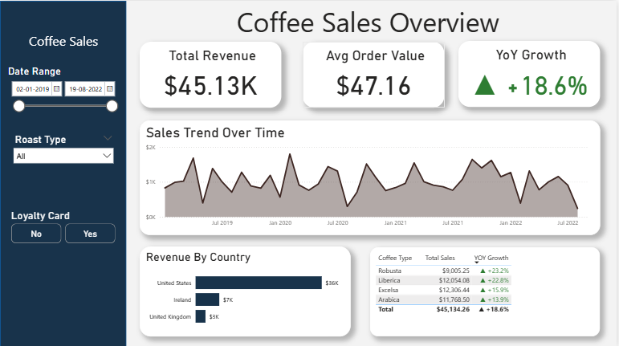

# ☕ Executive Coffee Sales Dashboard | Excel & Power BI Hybrid Project


> **A hybrid Business Intelligence project demonstrating full-cycle data analysis: Advanced Data Cleaning in Excel  Relational Modeling & Dashboarding in Power BI.**




---

## 📖 Project Overview
This project upgrades a traditional static reporting process into a dynamic executive dashboard. 
I utilized **Excel** to mimic a real-world ETL process (cleaning and normalizing raw data) and **Power BI** to deliver scalable, interactive insights.

**The Goal:** Transform raw transaction logs into actionable insights regarding **Year-over-Year growth**, **Product Seasonality**, and **Customer Loyalty**.

---

## Business Insights (Derived from Analysis)
By visualizing the dataset, the following key trends were identified:

### 1.Growth & Financial Health
* **Strong Upward Trend:** The company generated **$45.13K** in Total Revenue with a healthy **+18.6% Year-over-Year (YoY) Growth**.
* **Order Value:** The Average Order Value (AOV) stands at **$47.16**, indicating a strong premium customer base.

### 2. Market Performance (The "US Dominance")
* **Primary Market:** The **United States** is the overwhelming leader, contributing **$36K** (approx. 80%) of total revenue.
* **Expansion Opportunity:** Ireland ($7K) and the UK ($3K) represent significantly smaller markets, suggesting either a need for localized marketing or a strategic pivot to focus solely on the US.

### 3. Product Matrix (Cash Cows vs. Stars)
* **Top Revenue Driver:** **Excelsa** beans are the best seller, generating **$12.3K** in sales.
* **Fastest Growing:** While **Robusta** has the lowest total sales ($9K), it has the **highest growth rate (+23.2%)**, indicating rising popularity.
* **Growth Consistency:** All 4 coffee types (Arabica, Excelsa, Liberica, Robusta) are showing double-digit growth (+13% to +23%), proving a strong overall market demand.

---

## Phase 1: Excel Data Engineering (ETL)
*File:* `coffee_data.xlsx`

Before importing data into Power BI, I performed rigorous data transformation in Excel to ensure data quality. I utilized advanced lookup and logical functions to enrich the raw transaction data.

###  Formulas Applied (Workflow):
1.  **Data Enrichment (`XLOOKUP`):**
    * *Action:* Merged Customer Name, Email, and Country from the *Customers* table into the *Orders* table to verify data integrity.
2.  **Dynamic Reference (`INDEX` & `MATCH`):**
    * *Action:* Used `INDEX` + `MATCH` to dynamically retrieve Coffee Type, Roast Type, and Unit Price based on Product IDs.
    * *Why:* This method is more robust against column structural changes than VLOOKUP.
3.  **Data Standardization (`IF` Statements):**
    * *Action:* Nested `IF` statements were written to convert cryptic abbreviations (e.g., "Rob", "M") into business-friendly terms ("Robusta", "Medium").
    * *Formula Used:* `=IF(I2="Rob","Robusta",IF(I2="Ara","Arabica",...))`

---

## Phase 2: Power BI Architecture
*File:* `Coffee Sales Dashboard.pbix`

Once cleaned, I imported the data into Power BI to build a scalable data model.

### 1. Data Modeling (Star Schema)
I normalized the flat Excel data into a Star Schema to optimize performance:
* **Fact Table:** `Orders` (Transactions)
* **Dimension Tables:** `Customers`, `Products`, `Date Table`
* **Relationships:** One-to-Many relationships established between Dimensions and Fact table.

### 2. Advanced DAX Measures
I moved beyond standard Excel Pivot Tables by implementing Time Intelligence measures:

* **Year-over-Year (YoY) Growth %:**
    ```dax
    YoY Growth = 
    VAR CurrentSales = [Total Sales]
    VAR PreviousSales = CALCULATE([Total Sales], SAMEPERIODLASTYEAR('Date Table'[Date]))
    RETURN
        DIVIDE(CurrentSales - PreviousSales, PreviousSales, 0)
    ```
* **Dynamic Visual Indicators:** * Implemented custom format strings (`"▲" +#0.0%;"▼" -#0.0%;"-"`) to automatically display Up/Down arrows in the KPI cards based on positive or negative trends.
